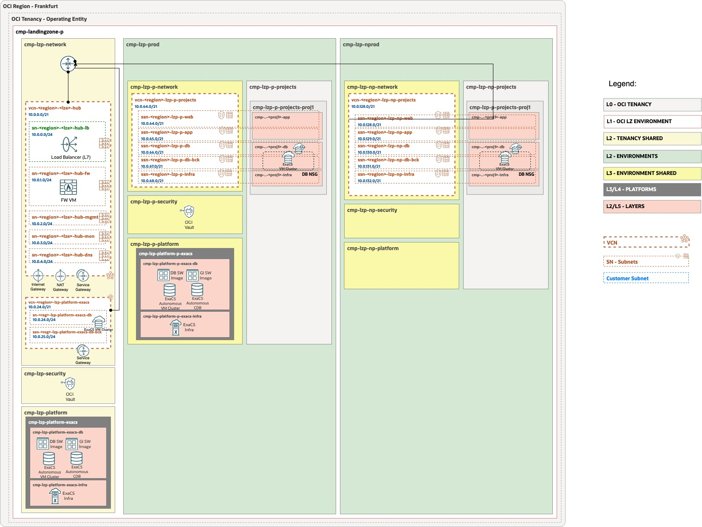
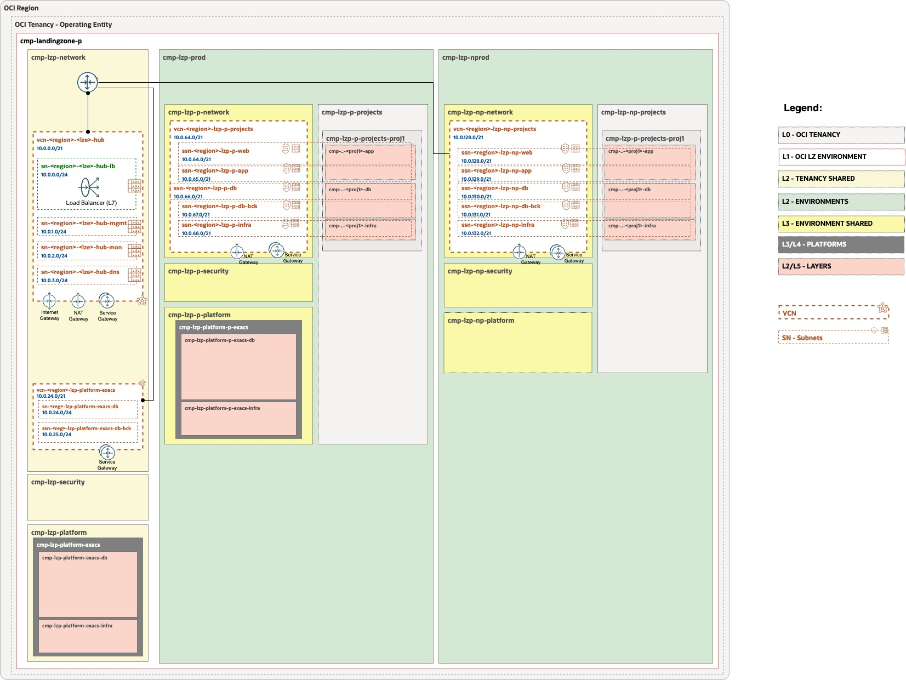

# RUNTIME

## Architecture of this ExaCS Workload Extension example: 


Architecture using Hub B:


Architecture using Hub E:


## Running with OCI Resource Manager Service

**DEPLOY WITH ORM** </br></br>[](https://cloud.oracle.com/resourcemanager/stacks/create?zipUrl=https://github.com/oci-landing-zones/terraform-oci-modules-orchestrator/archive/refs/tags/v2.0.6.zip&zipUrlVariables={"input_config_files_urls":"https://raw.githubusercontent.com/paalonso/exacs/refs/heads/main/1stack/oci_open_lz_one-oe_iam.auto.tfvars.json,https://raw.githubusercontent.com/paalonso/exacs/refs/heads/main/1stack/oci_open_lz_hub_b_network_light.auto.tfvars.json,https://raw.githubusercontent.com/paalonso/exacs/refs/heads/main/1stack/oci_open_lz_one-oe_observability_cisl1.auto.tfvars.json"})  </br></br> And follow these steps:</br>1. Accept terms,  wait for the configuration to load. </br>2. Set the working directory to “rms-facade”. </br>3. Set the stack name you prefer.</br>4. Set the terraform version to 1.5.x. Click Next. </br>5. Accept the default files. Click Next. Optionally, replace with your json/yaml config files. </br>6. Un-check run apply. Click Create. </br> </br>

## Running with Terraform CLI

### Get the OCI LZ Orchestrator

#### Clone the Orchestrator:

```
git clone git@github.com:oci-landing-zones/terraform-oci-modules-orchestrator.git
```

#### Initialize the Orchestrator:

```
terraform init
```

### One Single Stack

```
$ terraform plan -var-file ../exacc/1stack/oci-credentials.tfvars.json \
-var-file ../exacs/1stack/oci_open_lz_one-oe_iam.auto.tfvars.json \
-var-file ../exacs/1stack/oci_open_lz_hub_b_network_light.auto.tfvars.json \
-state ../exacs/1stack/terraform.tfstate
```

This configuration deploys the [Hub B](https://github.com/oci-landing-zones/oci-landing-zone-operating-entities/blob/master/addons/oci-hub-models/hub_b/readme.md) in its light version, this is, to deploy a Dummy VM acting as Firewall. Follow the **post deployment** steps of the Hub B link.

After you've created the FW Dummy VM, you'd need to replace the network JSON configuration with this one ***after replacing*** the "FW PRIVATE IP OCID" with the VM Private IP OCID.

After that change, update your config with (notice the change of the networking JSON file with the post one):

```
$ terraform plan -var-file ../exacc/1stack/oci-credentials.tfvars.json \
-var-file ../exacs/1stack/oci_open_lz_one-oe_iam.auto.tfvars.json \
-var-file ../exacs/1stack/oci_open_lz_hub_b_network_light_post.auto.tfvars.json \
-state ../exacs/1stack/terraform.tfstate
```

Adding ***Observability Services (events, alarms & logging)***:

```
$ terraform apply -var-file ../exacs/1stack/oci-credentials.tfvars.json \
-var-file ../exacs/1stack/oci_open_lz_one-oe_iam.auto.tfvars.json \
-var-file ../exacs/1stack/oci_open_lz_hub_b_network_light_post.auto.tfvars.json \
-var-file ../exacs/1stack/oci_open_lz_one-oe_observability_cisl1_addon_flowlogs.auto.tfvars.json \
-state ../exacs/1stack/terraform.tfstate
```

